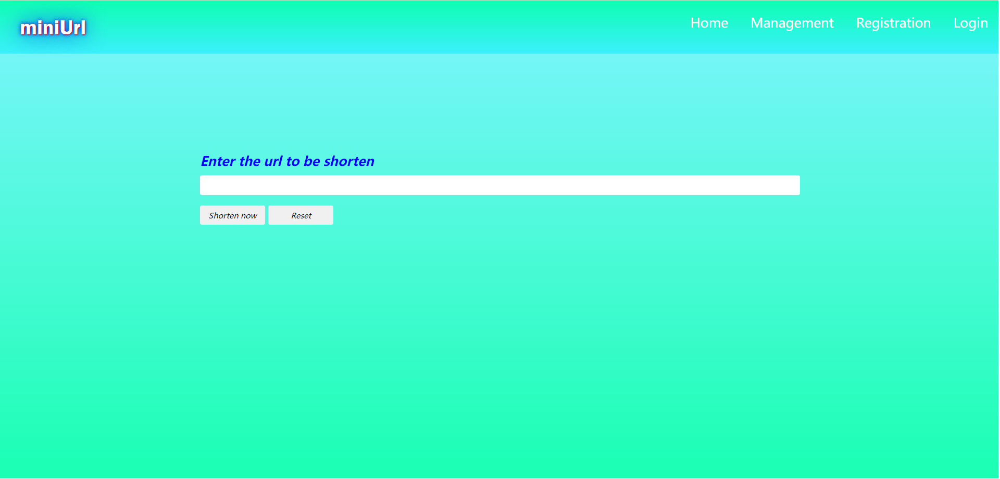
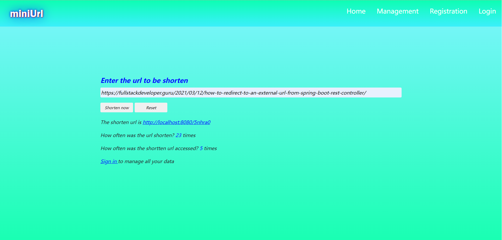
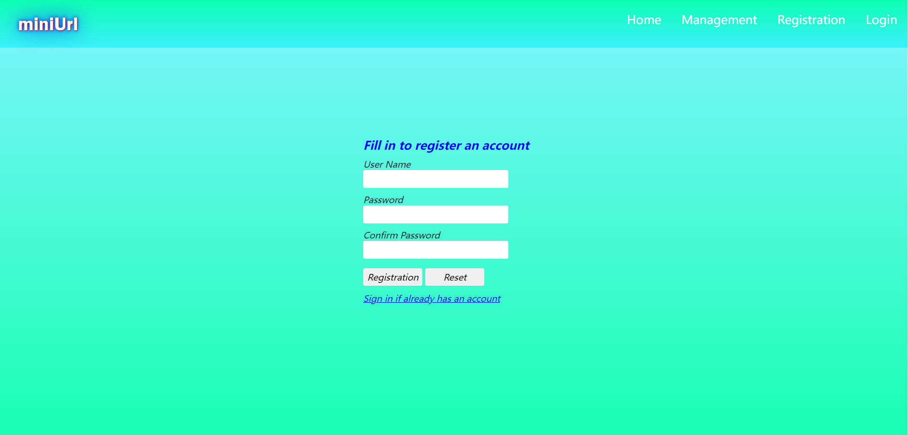
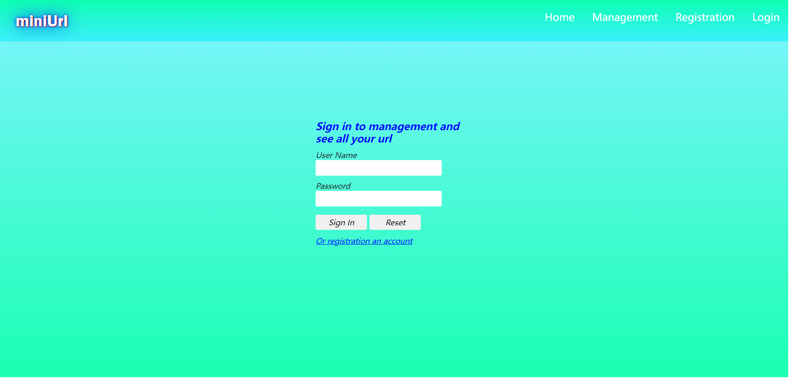
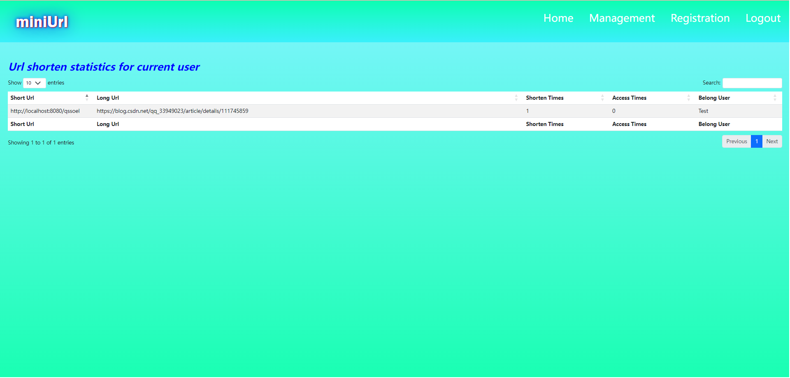
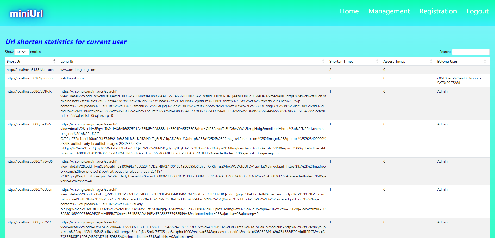

# miniUrl-vue
Vue + SpringBoot + MongoDB

1.This project provide below function

(1) Create short link for long web address  
(2) When open the short link in browser can access to the long web address accordingly  
(3) Keep statistics for how often the short link accessed, how much time the long address is request to be shorten  
(4) User can register and login  
(5) User can see their own statistics, the administrator can see data of all users  
(6) Support defense to XSS and CSRF attack  
(7) Support automation unit test, integration test, end to end test  

2.The technology framework

(1) Front end – Vue 3.3.4  
(2) Back end – SpringBoot 3.1.0  
(3) Database – MongoDB 6.0.6  
(4) Datatable - UI component to create beatiful table  

3. The final UI pages

The UI is just some prototype and has not been designed by UI engineer

  
  
  
  
  
  

